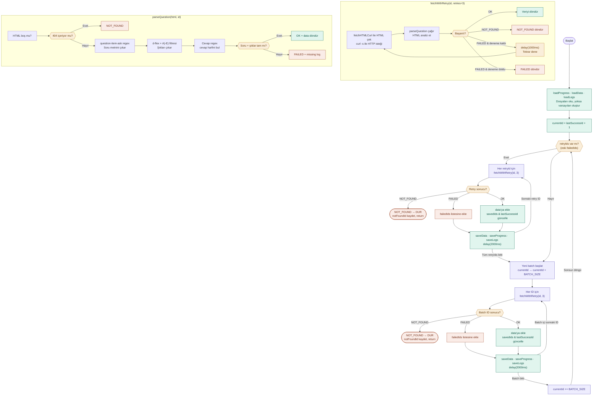

# OGM Materyal Verileri Nasıl Çekiliyor?

### getQuestions.js

```mermaid
flowchart TD
    A([Başlat]) --> B

    B["loadProgress · loadData · loadLogs\nDosyaları oku, yoksa varsayılan oluştur"]:::green
    B --> C

    C["currentId = lastSuccessId + 1"]:::green
    C --> D

    D{{"retryIds var mı?\n(eski failedIds)"}}:::amber
    D -- Evet --> E
    D -- Hayır --> H

    E["Her retryId için\nfetchWithRetry(id, 3)"]:::purple
    E --> F

    F{{"Retry sonucu?"}}:::amber
    F -- NOT_FOUND --> G1
    F -- FAILED --> G2
    F -- OK --> G3

    G1(["NOT_FOUND → DUR\nnotFoundId kaydet, return"]):::red
    G2["failedIds listesine ekle"]:::red
    G3["data'ya ekle\nsavedIds & lastSuccessId güncelle"]:::green

    G2 --> G4
    G3 --> G4
    G4["saveData · saveProgress · saveLogs\ndelay(2000ms)"]:::green
    G4 -- Sonraki retry ID --> E
    G4 -- Tüm retryIds bitti --> H

    H["Yeni batch başlat\ncurrentId → currentId + BATCH_SIZE"]:::purple
    H --> I

    I["Her ID için\nfetchWithRetry(id, 3)"]:::purple
    I --> J

    J{{"Batch ID sonucu?"}}:::amber
    J -- NOT_FOUND --> K1
    J -- FAILED --> K2
    J -- OK --> K3

    K1(["NOT_FOUND → DUR\nnotFoundId kaydet, return"]):::red
    K2["failedIds listesine ekle"]:::red
    K3["data'ya ekle\nsavedIds & lastSuccessId güncelle"]:::green

    K2 --> K4
    K3 --> K4
    K4["saveData · saveProgress · saveLogs\ndelay(2000ms)"]:::green
    K4 -- Batch içi sonraki ID --> I
    K4 -- Batch bitti --> L

    L["currentId += BATCH_SIZE"]:::purple
    L -- Sonsuz döngü --> D

    subgraph fetchWithRetry["fetchWithRetry(id, retries=3)"]
        R1["fetchHTMLCurl ile HTML çek\ncurl -s ile HTTP isteği"] --> R2
        R2["parseQuestion çağır\nHTML analiz et"] --> R3
        R3{{"Başarılı?"}}:::amber
        R3 -- OK --> R4["Veriyi döndür"]:::green
        R3 -- NOT_FOUND --> R5["NOT_FOUND döndür"]:::red
        R3 -- FAILED & deneme kaldı --> R6["delay(1000ms)\nTekrar dene"]:::amber
        R3 -- FAILED & deneme doldu --> R7["FAILED döndür"]:::red
        R6 --> R1
    end

    subgraph parseQuestion["parseQuestion(html, id)"]
        P1["HTML boş mu?"] --> P2
        P2{{"404 içeriyor mu?"}}:::amber
        P2 -- Evet --> P3["NOT_FOUND"]:::red
        P2 -- Hayır --> P4
        P4["question-item-ask regex\nSoru metnini çıkar"] --> P5
        P5["d-flex + A)-E) filtresi\nŞıkları çıkar"] --> P6
        P6["Cevap regex\ncevap harfini bul"] --> P7
        P7{{"Soru + şıklar tam mı?"}}:::amber
        P7 -- Evet --> P8["OK + data döndür"]:::green
        P7 -- Hayır --> P9["FAILED + missing log"]:::red
    end

    classDef green fill:#E1F5EE,stroke:#0F6E56,color:#085041
    classDef purple fill:#EEEDFE,stroke:#534AB7,color:#3C3489
    classDef amber fill:#FAEEDA,stroke:#BA7517,color:#633806
    classDef red fill:#FAECE7,stroke:#993C1D,color:#712B13
```