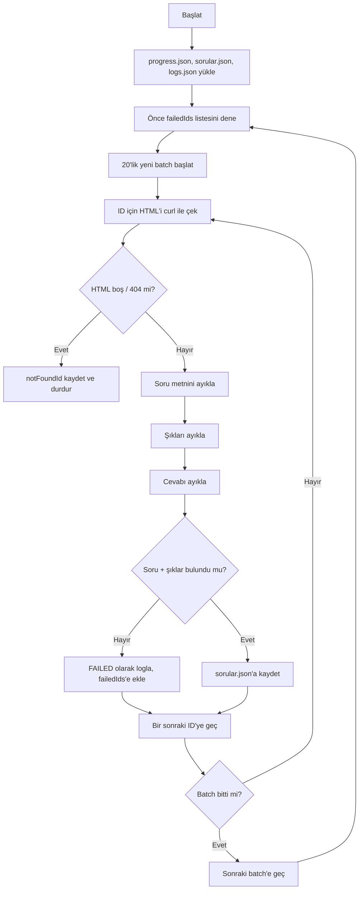
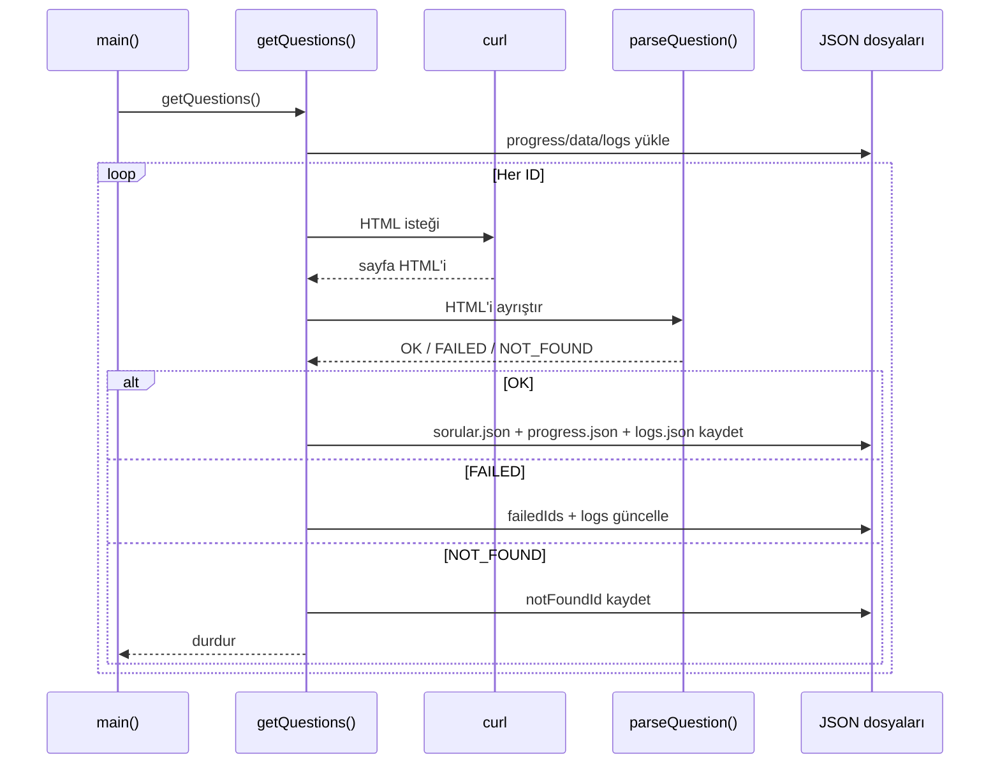

# Soru Toplayıcı

Bu proje, `ogmmateryal.eba.gov.tr` üzerindeki soru bankası testlerini ID bazlı dolaşarak soruları, şıkları ve doğru cevabı otomatik şekilde toplayan bir Node.js betiğidir. Çıktılar yerel diskte JSON dosyalarına kaydedilir; ilerleme bilgisi ve hata kayıtları da ayrı tutulur. Kod, `get-questions.js` içindeki toplama mantığını `index.js` üzerinden çalıştırır.

## Amaç

Bu programın temel amacı:

- belirli bir ID aralığındaki soruları taramak,
- sayfa HTML'inden soru, şıklar ve cevabı ayıklamak,
- başarılı kayıtları kalıcı JSON dosyasına yazmak,
- başarısız ID'leri daha sonra yeniden denemek,
- 404 bulununca işlemi durdurmak.

## Nasıl çalışır?

Program `index.js` ile başlar ve `getQuestions()` fonksiyonunu çalıştırır. Ana mantık `get-questions.js` içindedir.

İşleyiş şu sırayı izler:

1. `progress.json`, `sorular.json` ve `logs.json` okunur.
2. `lastSuccessId + 1` değerinden itibaren yeni tarama başlar.
3. Önce daha önce başarısız olmuş ID'ler tekrar denenir.
4. Ardından 20'şerlik batch'ler halinde yeni ID'ler işlenir.
5. Her ID için HTML, `curl` ile çekilir.
6. HTML içinden soru, şıklar ve cevap regex ile ayrıştırılır.
7. Sonuç başarılıysa `sorular.json` içine eklenir.
8. Her adımda `progress.json` ve `logs.json` güncellenir.
9. 404 görülürse program durdurulur.

## Dosya yapısı

```text
proje/
├─ index.js
├─ get-questions.js
└─ data/
   ├─ sorular.json
   ├─ progress.json
   └─ logs.json
```

Kod, `data` klasörünü yoksa otomatik oluşturur. fileciteturn0file0

## Çekilen veriler

Her başarılı kayıt şu alanlarla saklanır:

```json
{
  "id": 123,
  "question": "Soru metni",
  "choices": ["A) ...", "B) ...", "C) ...", "D) ...", "E) ..."],
  "answer": "C"
}
```

Başarılı kayıtların listesi `sorular.json` içine yazılır. fileciteturn0file0

## İlerleme takibi

`progress.json` şu bilgileri tutar:

- `lastSuccessId`: son başarılı ID,
- `savedIds`: kaydedilmiş ID'ler,
- `failedIds`: geçici olarak başarısız ID'ler,
- `notFoundId`: ilk 404 görülen ID. fileciteturn0file0

Bu yapı sayesinde program kapansa bile kaldığı yerden devam edebilir. fileciteturn0file0

## Loglama

`logs.json`, her ID için deneme bazlı log tutar. Her denemede:

- zaman damgası,
- adım adı,
- başarı/başarısızlık işareti,
- kısa detay açıklaması

kaydedilir. Böylece hangi adımın neden başarısız olduğu sonradan incelenebilir. fileciteturn0file0

## Çalışma akışı



## Ayrıntılı işlem diyagramı



## Ayrıştırma mantığı

Program HTML üzerinde üç ana kontrol yapar:

1. Boş HTML kontrolü
2. 404 kontrolü
3. Soru / şık / cevap regex kontrolü fileciteturn0file0

### Soru metni

Soru bloğu şu kalıpla aranır:

```js
/<p class="question-item-ask">([\s\S]*?)(?=<div class="form-check">)/
```

Eğer eşleşme bulunursa HTML etiketleri temizlenir ve sade metin elde edilir. fileciteturn0file0

### Şıklar

Şıklar `d-flex` blokları içinde aranır ve `A)` ile `E)` formatındaki değerler filtrelenir. fileciteturn0file0

### Cevap

Doğru cevap şu regex ile alınır:

```js
/<span>\s*\d+\s*-\s*([A-E])/
```

### Başarı ölçütü

Bir kaydın başarılı sayılması için en az:

- soru,
- bir veya daha fazla şık

bulunmalıdır. Cevap bulunamazsa kayıt yine de eksik olarak loglanır, ancak `success` kontrolü soru ve şıklar üzerinden yapılır. fileciteturn0file0

## Tekrar deneme mantığı

Her ID için en fazla 3 deneme yapılır. Denemeler arasında 1 saniye beklenir. Başarısız olan ID'ler `failedIds` listesine eklenir ve sonraki döngüde yeniden denenir. Ayrıca batch sonrasında da bekleme süresi uygulanır. fileciteturn0file0

Parametreler:

```js
START_ID = 1
BATCH_SIZE = 20
DELAY_MS = 2000
retries = 3
```

## Çalıştırma

```bash
node index.js
```

## Beklenen ortam

- Node.js
- `curl` komutu erişilebilir olmalı

Program `child_process.execSync` ile `curl` çalıştırdığı için sistemde `curl` bulunması gerekir. fileciteturn0file0

## Notlar

- Program aynı ID'yi tekrar kaydetmemek için `savedIds` kontrolü yapar.
- İlk 404 bulunduğunda tarama sonlandırılır.
- Başarısız ID'ler bir sonraki turda yeniden denenir.
- Ayrıştırma, sayfa HTML yapısına bağlıdır; HTML değişirse regex'ler güncellenmelidir. fileciteturn0file0

## Kısa özet

Bu proje, soru bankası sayfalarını sırayla dolaşan, içerik çıkaran, sonucu JSON'a yazan ve ilerlemeyi güvenli biçimde saklayan dayanıklı bir tarayıcıdır. Başarısız kayıtları tekrar denemesi ve ayrıntılı log tutması, toplu veri çekme senaryoları için pratik bir yapı sağlar. fileciteturn0file0
